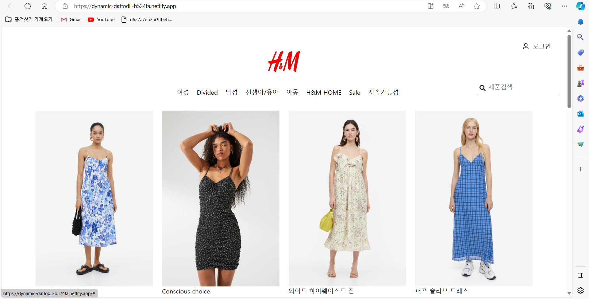
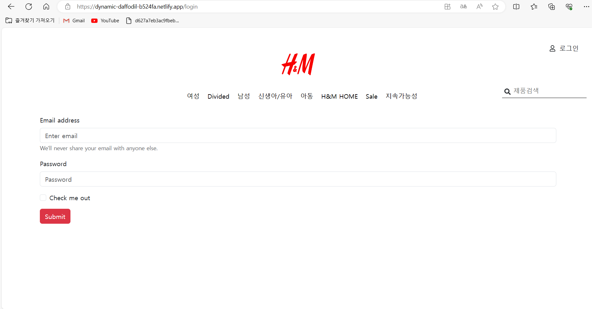
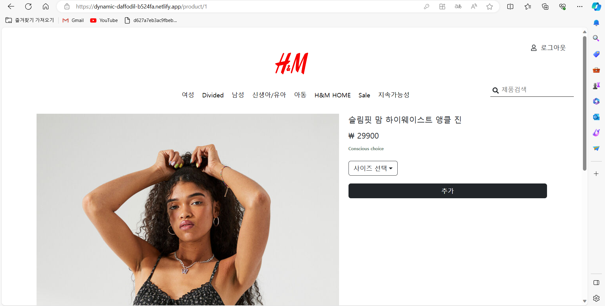
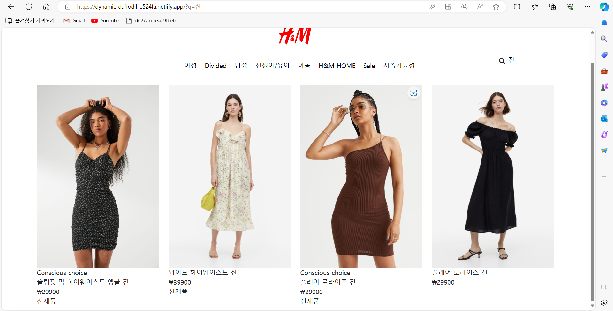

# H&M 프로젝트



H&M 쇼핑몰 사이트로써 기본적인 리액트 훅(useState, useEffect, useSearchParams 등등…)과 프론트엔드 지식을 활용하여 프로젝트를 배포까지 하였습니다.

### 배포 주소

https://dynamic-daffodil-b524fa.netlify.app/

## 화면 구성 🖥️

### 메인 페이지


### 로그인 페이지



### 상품 상세 페이지



## 주요 기능 🛠️

⭐ 상품 검색 기능

- json-server의 기본적인 기능을 활용하여, 원하는 상품을 검색할 수 있습니다.



⭐ Private Route 기능

- 상품 상세 페이지를 보기 위해서는 로그인을 해야합니다.
- 로그인을 하지 않고, 상품 상세 페이지로 이동 시 로그인 페이지로 redirect 됩니다.

⭐ Resonsive Web Design

- 기본적인 반응형 웹사이트 기능을 포함합니다.

⭐ 상품 데이터 베이스

- My JSON Server의 db.json파일을 이용하여 상품 데이터를 저장하였습니다.
- db.json파일을 기반으로 메인 페이지에서 모든 상품을 유저에게 보여주고, 상품 상세 페이지를 구성하였습니다.

## 시작 가이드

### 요구 사항

- Node.js

### 설치 및 시작

```jsx
$ git clone https://github.com/chobuzz/hnm.git
$ cd hnm
$ npm install
$ npm start
```
